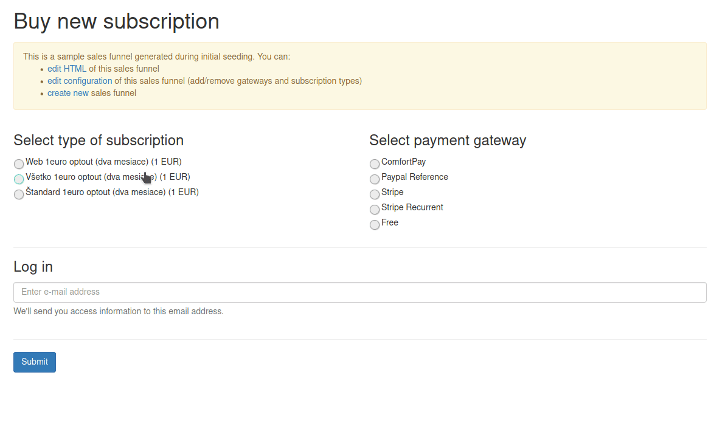
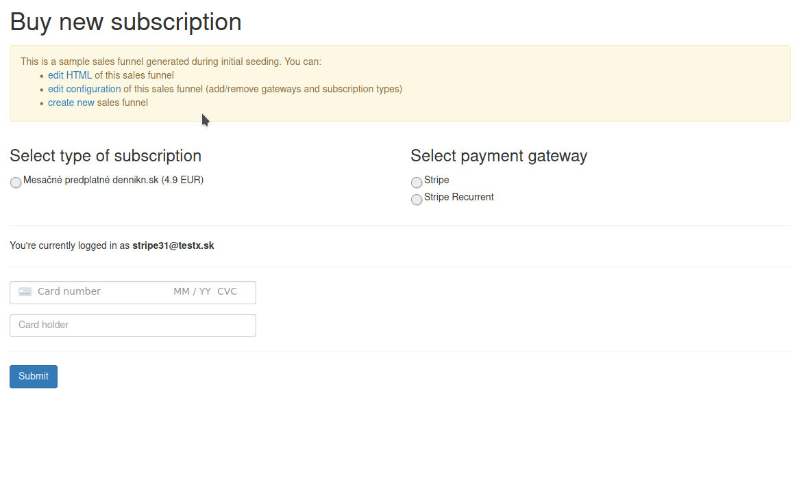

# CRM Stripe Module

## Installation

Add CRM module to your skeleton app with Composer.

```bash
composer require remp/crm-stripe-module
```

We recommend using Composer for installation and update management.

```bash
php bin/command.php application:seed
```

### Enabling module

1. Add installed extension to your app/config/config.neon file.

```neon
extensions:
	# ...
	- Crm\StripeModule\DI\StripeModuleExtension
```

2. Enter Stripe API keys to CRM

    - Visit to CRM admin settings (gear icon) - Payments
    - Enter *Stripe publishable* key
    - Enter *Stripe secret* key
    
Keys can be found at [Stripe Dashboard](https://dashboard.stripe.com/test/apikeys). If you don't have the account already, you'll need to create one.  

## Using module

### Stripe Checkout

Stripe Checkout is the most secure and robust scenario of processing payments with Stripe. User is redirected to Stripe's checkout page where he/she enters card details and submits the payment.

We recommend using this scenario as Stripe optimizes the page for various devices. Stripe Checkout is the default flow when this module is enabled.

If you use [remp2020/crm-salesfunnel-module](https://github.com/remp2020/crm-salesfunnel-module), all you need to do is to enable both *Stripe* and *Stripe Recurrent* gateways in your sales funnels (CRM Admin - Sales funnels - Detail - Payment gateways). If you use our [sample funnel](https://github.com/remp2020/crm-salesfunnel-module/blob/master/src/seeders/sales_funnels/sample.twig), it will display the new gateways automatically.



### Stripe Elements

Stripe Elements provide a secure way how to collect card data directly in your sales funnel. To use Stripe elements, include following snippets to your sales funnel.

Include Stripe JS library.

```html
<script src="https://js.stripe.com/v3/"></script>
```

Add elements that will be initialized to collect the data.

```html
<div>
    <label>Card holder</label>
    <input id="cardholder-name" class="form-control mb-4" type="text">
    <!-- placeholder for Elements -->
    <div id="card-element" class="form-control"></div>

    <!-- Used to display form errors -->
    <div id="card-errors" role="alert"></div>

    <!-- Used to store generated payment method ID as payment metadata -->
    <input type="hidden" name="payment_metadata[payment_method_id]" id="stripePaymentMethodId">
</div>
```

Initialize Stripe Elements.

```html
<script type="text/javascript">
    var stripe = Stripe('-- INCLUDE YOUR PUBLISHABLE KEY HERE --');
    var elements = stripe.elements();

    var cardElement = elements.create("card");
    cardElement.mount("#card-element");
    cardElement.addEventListener('change', function(event) {
        var displayError = document.getElementById('card-errors');
        if (event.error) {
            displayError.textContent = event.error.message;
        } else {
            displayError.textContent = '';
        }
    });
</script>
```

Attach Stripe handlers to the form submission process.

```js
function processStripe(form) {
    var paymentMethodIdField = $('#stripePaymentMethodId');
    var cardholderName = $('#cardholder-name');
    var selectedGateway = $('input[name=payment_gateway]').val();

    if (selectedGateway === 'stripe') {
        stripe.createPaymentMethod('card', cardElement, {
            billing_details: {name: cardholderName.value }
        }).then(function(result) {
            if (result.error) {
                alert(result.error.message);
            } else {
                paymentMethodIdField.val(result.paymentMethod.id);
                debugger;
                form.submit();
            }
        });
        return false;
    }

    if (selectedGateway === 'stripe_recurrent') {
        $.post('/api/v1/stripe/setup-intent', function($data) {
            stripe.confirmCardSetup(
                $data['client_secret'],
                {
                    payment_method: {
                        card: cardElement,
                        billing_details: {
                            name: cardholderName.value,
                        },
                    }
                },
            ).then(function(result) {
                if (result.error) {
                    alert(result.error.message);
                } else {
                    paymentMethodIdField.val(result.setupIntent.payment_method);
                    form.submit();
                }
            });
        }, 'json');
        return false;
    }
}

$(form).submit(function() {
    processStripe();
});
```
Stripe Module also seeded [funnel example with Stripe Elements usage](). You can find it in CRM Admin - Sales Funnels - Stripe Elements.

